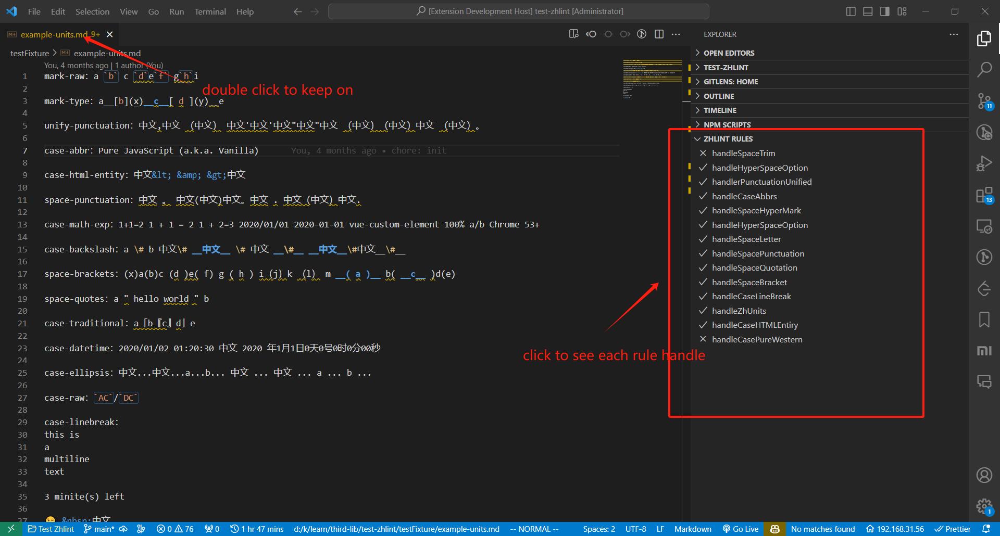
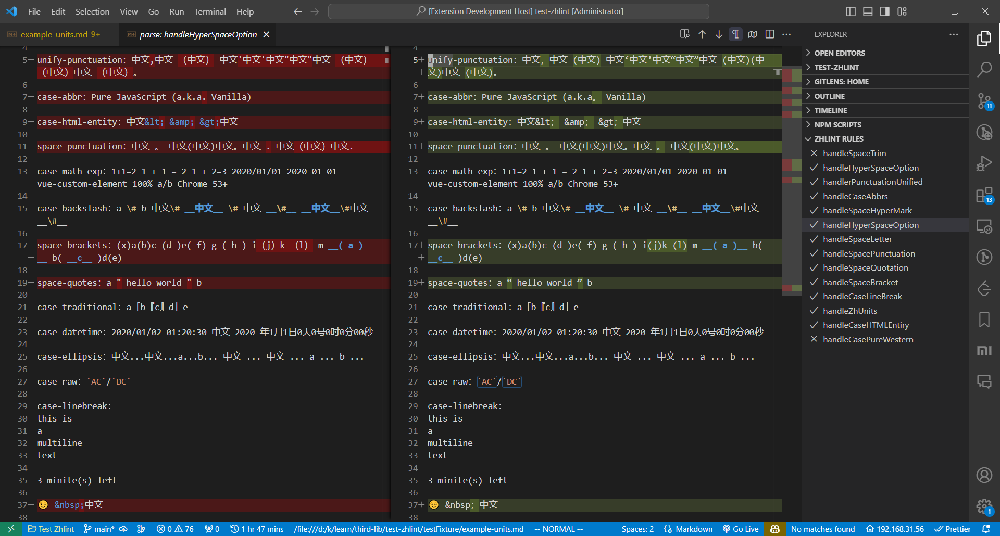

# VS Code zhlint Extension

<a href="https://marketplace.visualstudio.com/items?itemName=kkopite.zhlint" target="__blank"></a>

VS Code Extension for [zhlint](https://zhlint-project.github.io/zhlint/#supported-rules)

## Feature

- lint
- format

use `zhlint` as your default formatter for markdown

```json
{
  "[markdown]": {
    "editor.defaultFormatter": "kkopite.zhlint",
    "editor.formatOnSave": true
  }
}
```

you can use `Shift + Alt + F` or save to format your markdown with `zhlint`

Currently，only `.md` files are supported。If you want to support other file types，such as `.txt`

```json
{
  "files.associations": {
    "*.txt": "markdown"
  }
}
```

## config

this extension will use `readRc` and `runWithConfig` if there has `.zhlintr{c, c.json}`，`.zhlintignore`，`.zhlintcaseignore`，or it will use `run()` with `zhlint.options` in `.vscode/settings.json`

## Experimental Feature

these feature maybe remove in the future

### diff viewer

1. set `zhlint.experimental.diff` to `true`
2. Keep Open for your markdown file(which you want to see the diff)，checkout [How do I make VS Code open files in a new tab？](https://vscode.one/new-tab-vscode/)






## options

|`key`|`description`|`default`|
|:----|:-----------|:-------:|
|`zhlint.options`|see [zhlint options](https://zhlint-project.github.io/zhlint/#options),  `logger` is exclude  |`{}`|
|`zhlint.debug`|print extra message when run zhlint|`false`|
|`zhlint.enable`|Controls whether zhlint is enabled or not|`true`|
|`zhlint.experimental.diff` |enable rule diff viewer in explorer |`false`|

## Dev

- Run `npm install` in this folder。This installs all necessary npm modules in both the client and server folder
- Open VS Code on this folder。
- Press Ctrl+Shift+B to start compiling the client and server in [watch mode](https://code.visualstudio.com/docs/editor/tasks#:~:text=The%20first%20entry%20executes,the%20HelloWorld.js%20file.)。
- Switch to the Run and Debug View in the Sidebar (Ctrl+Shift+D)。
- Select `Launch Client` from the drop down (if it is not already)。
- Press ▷ to run the launch config (F5)。
- Select `Attach to Server` from the drop down，press F5 to attach the debugger to the server
